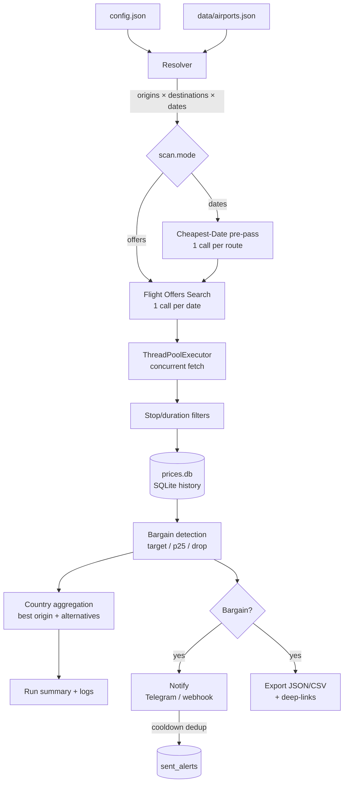
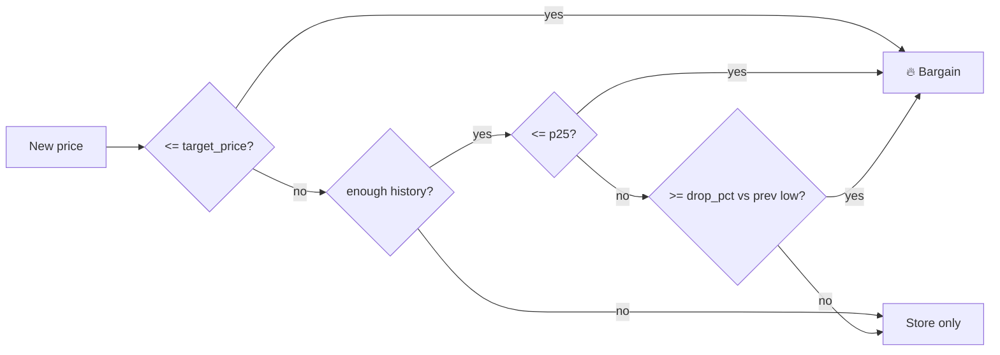

# ✈️ Flight Deals Scanner

[](https://github.com/hypeitnow/flight-deals-scanner/actions/workflows/ci.yml)
[](https://github.com/hypeitnow/flight-deals-scanner/actions/workflows/scan.yml)
[](https://www.python.org/)
[](#testing--development)
[](#testing--development)
[](#license)
[](#zero-dependencies)

> **Watch whole countries or specific airports for bargain flights from many origins at once.**
> The scanner tells you *which departure airport* gives the best deal, ranks alternatives,
> and alerts you the moment a fare drops below your target price or its own historical low.

Built on the **[Amadeus Self-Service API](https://developers.amadeus.com/)** (free tier:
~2,000 requests/month, instant self-signup). Skyscanner's `robots.txt` explicitly forbids
its deals/calendar pages and internal APIs, so this uses Amadeus for the same fare data
**within terms of service**.

---

## Table of contents

- [Why this exists](#why-this-exists)
- [Features](#features)
- [How it works](#how-it-works)
- [What it does (at a glance)](#what-it-does-at-a-glance)
- [Quick start](#quick-start)
- [Installation](#installation)
  - [Run from source](#run-from-source)
  - [Install as a CLI tool](#install-as-a-cli-tool)
  - [Docker](#docker)
- [CLI reference](#cli-reference)
- [Example output](#example-output)
- [Picking destinations](#picking-destinations)
- [Picking origins](#picking-origins)
- [Configuration reference](#configuration-reference)
- [Managing API quota](#managing-api-quota)
- [Notes](#notes)
- [Scheduled scanning (GitHub Actions)](#scheduled-scanning-github-actions)
- [Notifications](#notifications)
- [How bargains are detected](#how-bargains-are-detected)
- [Data model](#data-model)
- [Project structure](#project-structure)
- [Testing & development](#testing--development)
- [Troubleshooting](#troubleshooting)
- [FAQ](#faq)
- [Roadmap](#roadmap)
- [Changelog](#changelog)
- [License](#license)

---

## Why this exists

Most flight-deal sites either:

- **Lock you to one departure airport** — but if you live in Poland, the cheapest flight to
  Montenegro might leave from Kraków one week and Wrocław the next. You don't want to check
  six airports by hand.
- **Only search city-to-city** — but you often care about a *country* ("anywhere in Croatia"),
  not a specific airport.
- **Forbid scraping** — Skyscanner, Google Flights, and Kiwi all restrict automated access.

This tool solves all three: **country-level destinations**, **multi-origin ranking**, and a
**ToS-compliant data source**. It keeps a local price history so it can tell the difference
between "cheap" and "cheap *for this route*".

## Features

| Capability | Description |
|---|---|
| 🌍 **Country-level search** | `ME` → all Montenegrin airports (TGD, TIV); `HR` → ZAG, SPU, DBV, … |
| 🛫 **Multi-origin ranking** | Scan all Polish airports at once; see which one is cheapest per destination |
| 🥇 **Best + alternatives** | Shows the winning origin plus the top-3 alternative departure airports |
| 💰 **3-way bargain detection** | Target price **OR** historical p25 **OR** sharp drop vs previous low |
| 📈 **Local price history** | Every fare stored in SQLite (`prices.db`) for trend/percentile analysis |
| 🔁 **Outbound + return metrics** | Captures stops and flight duration for **both** legs |
| 🎚 **Stop/duration filters** | `max_stops`, `max_duration_min` to exclude painful itineraries |
| ⚡ **Concurrent scanning** | `ThreadPoolExecutor` parallelises HTTP calls; thread-safe token refresh |
| 📅 **Cheapest-date mode** | Optional pre-pass finds the cheapest dates per route in **one** API call |
| 🛡 **API-budget guardrails** | Estimates calls before scanning; aborts over cap; monthly quota tracking |
| 🔔 **Smart notifications** | Telegram / webhook alerts with 24 h cooldown dedup + booking deep-links |
| 📤 **Export** | `--export json\|csv` with Kayak + Skyscanner deep-links per offer |
| 📝 **Structured logging** | `--verbose` / `--quiet`, plus an always-visible run summary |
| 🤖 **Runs itself** | Ships a scheduled GitHub Actions workflow — a zero-infra deal-watching service |

### Zero dependencies

The scanner uses the **Python standard library only** (`urllib`, `sqlite3`, `json`,
`argparse`, `threading`, `concurrent.futures`, `hashlib`). No `pip install` of third-party
packages is required to run it. The only dev-time extras are `pytest`, `ruff`, and `mypy`
for the test/CI pipeline.

## How it works



**Pipeline in words:**

1. **Resolve** — expand country codes / groups into concrete IATA airport lists.
2. **Plan** — build the origin × destination × date task list; estimate API calls and
   abort if over the configured cap (or monthly quota).
3. **Fetch** — query Amadeus concurrently for the cheapest fare on each route/date.
   In `dates` mode, a cheapest-date pre-pass narrows each route to its best dates first.
4. **Filter** — drop offers exceeding `max_stops` / `max_duration_min`.
5. **Store** — write every observation to `prices.db`.
6. **Detect** — flag bargains against your target price, the route's historical p25, or a
   sharp drop from its previous low.
7. **Report** — rank origins per destination country, print a run summary, and optionally
   notify + export with booking deep-links.

## What it does (at a glance)

- Define destinations **by country** (`ME` = Montenegro, `BA` = Bosnia, `HR` = Croatia)
  or by specific airport IATA code — the scanner expands countries to all their airports.
- Define origins as a **group** (`poland_major`, `poland_all`), a country code (`PL`),
  a list of IATAs, or a single airport.
- It queries the **cheapest fare + stops + flight duration** for every
  origin × destination airport × date combination.
- Stores every price in a local SQLite history (`prices.db`).
- **Ranks departure airports** per destination country — shows which city
  to fly from and highlights alternatives.
- Flags a **bargain** when a price is:
  - `<=` your `target_price` for that destination, **or**
  - `<=` the route's historical *p25* (after `min_history` observations), **or**
  - a `drop_pct_alert`% drop below the previous low.
- **API-budget guardrail**: estimates call count before scanning; aborts if over cap.
- Optional **Telegram / webhook** notifications on bargains.

## Quick start

```bash
# 1. Clone
git clone https://github.com/hypeitnow/flight-deals-scanner.git
cd flight-deals-scanner

# 2. Try it offline — no API key, no install, synthetic prices
python3 flight_scanner.py --demo

# 3. Add real credentials (free Amadeus self-service key)
cp .env.example .env      # paste AMADEUS_CLIENT_ID / AMADEUS_CLIENT_SECRET

# 4. Preview the API-call cost, then run for real
python3 flight_scanner.py --estimate
python3 flight_scanner.py
```

## Installation

The scanner needs **Python 3.10+** and nothing else to run. Three ways to use it:

### Run from source

```bash
git clone https://github.com/hypeitnow/flight-deals-scanner.git
cd flight-deals-scanner
cp .env.example .env        # paste your Amadeus key & secret
# edit config.json -> set origins, currency, and your destinations
python3 flight_scanner.py --demo
```

Get free Amadeus credentials at <https://developers.amadeus.com/> → **Create app** →
copy **API Key** and **API Secret** into `.env`. No `pip install` needed (stdlib only).

### Install as a CLI tool

```bash
pip install -e .          # installs the `flight-scanner` console command
flight-scanner --demo     # runs offline demo
flight-scanner --help
```

### Docker

```bash
# Build image
docker build -t flight-deals-scanner .

# Demo (no credentials needed)
docker run --rm flight-deals-scanner --demo

# Real scan — mount config + .env, persist prices.db
docker run --rm \
  -v $(pwd)/config.json:/app/config.json:ro \
  -v $(pwd)/.env:/app/.env:ro \
  -v $(pwd)/prices.db:/app/prices.db \
  flight-deals-scanner

# Or with Docker Compose
docker compose run scanner --demo
```

## CLI reference

Every flag is optional. With no flags, the scanner runs a real scan using `config.json`
and `.env`.

| Flag | Argument | Description |
|---|---|---|
| `--demo` | — | Offline run with **synthetic** prices. No API key, no network, no quota used. Ideal for trying the tool or CI. |
| `--estimate` | — | Print the estimated API-call count for the current config and **exit without scanning**. |
| `--quota` | — | Show month-to-date API-call usage (tracked in `prices.db`) and exit. |
| `--history` | — | Print the stored price-history summary (min / p25 / median per route) and exit. |
| `--export` | `json` \| `csv` | After scanning, write all results to `scan_export_<date>.<fmt>` with Kayak + Skyscanner deep-links. |
| `--config` | `PATH` | Use an alternate config file (default: `config.json`). |
| `--verbose` | — | DEBUG-level logging — shows every route, API call, and decision. |
| `--quiet` | — | Suppress INFO logs; warnings and errors only. Good for cron. |
| `-h`, `--help` | — | Show usage and exit. |

> `--verbose` and `--quiet` are mutually exclusive in spirit; if both are passed, `--verbose` wins.

### Common commands

```bash
python3 flight_scanner.py --demo
# or, after pip install -e .:
flight-scanner --demo

# Preview how many API calls a scan would make, without scanning:
python3 flight_scanner.py --estimate

# Real scan (uses .env credentials + config.json):
python3 flight_scanner.py

# Show stored price-history summary per route:
python3 flight_scanner.py --history

# Month-to-date API quota usage:
python3 flight_scanner.py --quota

# Export results to CSV/JSON after scan:
python3 flight_scanner.py --demo --export csv

# Verbose logging (DEBUG):
python3 flight_scanner.py --demo --verbose

# Quiet run with a custom config (good for cron):
python3 flight_scanner.py --quiet --config prod.config.json
```

## Example output

*Demo mode, Poland → Balkans:*

```
Scanning 6 origin(s) × 13 dest airport(s) × 4 date(s)
  Estimated API calls: 312  (cap: 500)

  [Montenegro]             best: WRO→TIV    431 PLN  1 stop(s) 4h52m  2026-07-04..2026-07-11 🔥
                           alt:  KRK→TGD    442 PLN  1 stop(s)  2026-07-03..2026-07-08
                           alt:  WMI→TIV    443 PLN  direct     2026-07-03..2026-07-08
  [Bosnia & Herzegovina]   best: KTW→SJJ    465 PLN  1 stop(s) 3h08m  2026-07-03..2026-07-08 🔥
                           alt:  WMI→SJJ    476 PLN  direct     2026-07-04..2026-07-11
  [Croatia]                best: WMI→ZAG    324 PLN  direct 2h30m  2026-07-03..2026-07-08 🔥
                           alt:  WAW→ZAG    359 PLN  direct     2026-07-04..2026-07-09
```

Run daily so the history builds up and the percentile/drop detection becomes meaningful:

```cron
# crontab -e  — scan every morning at 08:00
0 8 * * *  cd ~/repos/flight-deals-scanner && /usr/bin/python3 flight_scanner.py >> scan.log 2>&1
```

## Picking destinations

### By country (recommended)
Use the 2-letter ISO country code. The scanner expands it to all known airports:

```json
"destinations": [
  { "country": "ME", "label": "Montenegro",          "target_price": 600 },
  { "country": "BA", "label": "Bosnia & Herzegovina", "target_price": 650 },
  { "country": "HR", "label": "Croatia",              "target_price": 500 }
]
```

Supported countries include all major European destinations plus Turkey, Morocco,
Egypt, UAE, Thailand, Japan, and more. See `data/airports.json` for the full list.

### By specific airport
```json
"destinations": [
  { "destination": "TIV", "label": "Tivat (Montenegro)", "target_price": 550 }
]
```

### By named group
```json
"destinations": [
  { "group": "med_beach", "label": "Med beaches", "target_price": 500 }
]
```
Available groups: `balkans`, `med_beach`, `western_europe` (see `data/airports.json`).

## Picking origins

### All major Polish airports (recommended starting point)
```json
"origins": { "group": "poland_major" }
```
Expands to: WAW, WMI, KRK, KTW, GDN, WRO.

### All Polish airports (more thorough, more API calls)
```json
"origins": { "group": "poland_all" }
```
Adds: POZ, RZE, SZZ, BZG, SZY, LUZ.

### By country code
```json
"origins": { "country": "PL" }
```

### Specific list
```json
"origins": ["WAW", "KRK", "KTW"]
```

### Single airport (legacy / simple mode)
```json
"origins": "WAW"
```

## Configuration reference

All behaviour is driven by `config.json`. Below is a complete, annotated example followed
by a field-by-field reference.

```jsonc
{
  "amadeus_env": "test",                 // "test" (free sandbox) or "production"
  "origins": { "group": "poland_major" },// group / country / IATA list / single IATA
  "currency": "PLN",                     // price currency
  "adults": 1,                           // passenger count
  "non_stop": false,                     // true = direct flights only
  "max_offers_per_query": 5,             // offers to request per route/date

  "scan": {
    "date_from": "2026-07-03",           // earliest departure date
    "date_to": "2026-09-30",             // latest departure date
    "weekdays": [4, 5],                  // 0=Mon … 6=Sun; here Fri + Sat
    "trip_length_days": [5, 7],          // round-trip nights; [null] = one-way
    "max_dates_per_route": 4,            // cap on date pairs per route (limits API calls)
    "mode": "offers",                    // "offers" (default) or "dates" (cheapest-date pre-pass)
    "max_stops": null,                   // e.g. 1 = drop offers with >1 stop; null = no filter
    "max_duration_min": null             // e.g. 240 = drop legs longer than 4 h; null = no filter
  },

  "destinations": [
    { "country": "ME", "label": "Montenegro",          "target_price": 600 },
    { "country": "BA", "label": "Bosnia & Herzegovina", "target_price": 650 },
    { "country": "HR", "label": "Croatia",              "target_price": 500 }
  ],

  "limits": {
    "max_api_calls": 500,                // abort if a scan would exceed this many calls
    "monthly_cap": null,                 // abort if month-to-date calls would exceed this
    "dates_mode_top_n": 3                // in "dates" mode, keep the N cheapest dates per route
  },

  "bargain": {
    "percentile": 25,                    // historical percentile that counts as a bargain
    "min_history": 5,                    // observations needed before percentile logic kicks in
    "drop_pct_alert": 15                 // % drop vs previous low that triggers an alert
  },

  "notify": {
    "telegram": { "enabled": false, "bot_token": "", "chat_id": "" },
    "webhook":  { "enabled": false, "url": "" },
    "cooldown_hours": 24                 // suppress repeat alerts for the same route within N hours
  }
}
```

### Top-level

| Field | Meaning |
|---|---|
| `amadeus_env` | `test` (sandbox, free) or `production` (live fares, needs a prod app) |
| `origins` | Origin(s): group name, country code, IATA list, or single IATA — see [Picking origins](#picking-origins) |
| `currency` | Price currency (`PLN`, `EUR`, …) |
| `adults` | Number of adult passengers |
| `non_stop` | `true` = direct flights only |
| `max_offers_per_query` | How many offers Amadeus returns per route/date (cheapest is used) |

### `scan`

| Field | Meaning |
|---|---|
| `date_from` / `date_to` | Travel window to search |
| `weekdays` | Departure weekdays, `0`=Mon…`6`=Sun (e.g. `[4,5]` = Fri+Sat) |
| `trip_length_days` | Round-trip nights, e.g. `[5,7]`; use `[null]` for one-way |
| `max_dates_per_route` | Cap on date pairs per route (controls API-call volume) |
| `mode` | `offers` (one call per date) or `dates` (cheapest-date pre-pass — far fewer calls) |
| `max_stops` | Drop offers with more than this many stops; `null` disables |
| `max_duration_min` | Drop legs longer than this many minutes; `null` disables |

### `destinations[]`

| Field | Meaning |
|---|---|
| `country` | Destination country code — expands to all its airports |
| `destination` | OR a single destination IATA code |
| `group` | OR a named airport group (see `data/airports.json`) |
| `label` | Friendly name shown in output |
| `target_price` | Hard bargain threshold for this destination |

### `limits`

| Field | Meaning |
|---|---|
| `max_api_calls` | Scan aborts if estimated calls exceed this (default: 500) |
| `monthly_cap` | Scan aborts if month-to-date calls would exceed this; `null` disables |
| `dates_mode_top_n` | In `dates` mode, how many cheapest dates per route to keep |

### `bargain`

| Field | Meaning |
|---|---|
| `percentile` | Historical percentile threshold for a bargain alert (e.g. 25 = p25) |
| `min_history` | Observations needed before percentile logic activates |
| `drop_pct_alert` | % drop vs previous low that triggers an alert |

### `notify`

| Field | Meaning |
|---|---|
| `telegram.enabled` / `bot_token` / `chat_id` | Telegram bot alerts (see [Notifications](#notifications)) |
| `webhook.enabled` / `url` | POST a JSON payload to an arbitrary URL on a bargain |
| `cooldown_hours` | Suppress repeat notifications for the same route within N hours (default 24) |

## Managing API quota

The free Amadeus test tier gives ~2,000 calls/month. Use `--estimate` to preview:

```bash
python3 flight_scanner.py --estimate
# Origins: 6  ['WAW', 'WMI', 'KRK', 'KTW', 'GDN', 'WRO']
# Destination groups: 3 | Dest airports: 13
# Date pairs: 4
# Estimated calls: 312  (cap: 500)  ✅ Within cap.
```

Tips to reduce calls:
- Lower `scan.max_dates_per_route` (4 is a good daily value)
- Use `"group": "poland_major"` instead of `poland_all`
- Use `"non_stop": true` to cut irrelevant routes
- Raise `limits.max_api_calls` only after verifying your monthly quota

## Notes

- The free **test** environment returns realistic but cached fares — great for
  development. Switch `amadeus_env` to `production` for live booking-grade prices
  (requires a separate production app on the Amadeus portal).
- This is for **personal deal-watching**. Don't redistribute fares commercially
  without an appropriate Amadeus commercial agreement.
- Airport lists in `data/airports.json` are curated and editable — add or remove
  airports per country as needed.

## Scheduled scanning (GitHub Actions)

The repo ships a **cron workflow** (`.github/workflows/scan.yml`) that turns this into a
running service with zero infrastructure:

| Feature | Detail |
|---|---|
| Schedule | Mon + Thu at 06:00 UTC (≈8 runs/month, well within the 2,000-call free tier) |
| `prices.db` | Persisted between runs via `actions/cache`; also uploaded as a 90-day artifact |
| Secrets | `AMADEUS_CLIENT_ID`, `AMADEUS_CLIENT_SECRET`, `TELEGRAM_BOT_TOKEN`, `TELEGRAM_CHAT_ID` |
| Fallback | No Amadeus secrets → auto-switches to `--demo` mode (safe, no quota used) |
| Manual run | **Actions → Scheduled Scan → Run workflow** → choose `demo` or `real`, optional export |

### Setup

1. Fork / push to your GitHub account.
2. **Settings → Secrets → Actions** → add:
   - `AMADEUS_CLIENT_ID` + `AMADEUS_CLIENT_SECRET` (from Amadeus portal)
   - `TELEGRAM_BOT_TOKEN` + `TELEGRAM_CHAT_ID` *(optional — for Telegram alerts)*
3. Enable Actions in the repository.
4. The workflow runs automatically on schedule, or trigger it manually anytime.

> **Tip**: set `notify.telegram.enabled: true` in `config.json` and commit it — the
> workflow reads Telegram credentials from repo secrets and sends alerts directly to
> your chat.

## Notifications

When a bargain is detected, the scanner can push an alert through one or both channels.
Each alert includes the route, price, stops/duration, travel dates, and a **Kayak booking
deep-link**. Repeat alerts for the same route are suppressed for `notify.cooldown_hours`
(default 24 h) using the `sent_alerts` table.

### Telegram

1. Create a bot with [@BotFather](https://t.me/BotFather) → copy the **bot token**.
2. Send your bot a message, then visit
   `https://api.telegram.org/bot<TOKEN>/getUpdates` to find your **chat id**.
3. Configure:

```json
"notify": {
  "telegram": { "enabled": true, "bot_token": "123456:ABC...", "chat_id": "987654321" },
  "cooldown_hours": 24
}
```

In CI, leave the token/id blank in `config.json` and set `TELEGRAM_BOT_TOKEN` /
`TELEGRAM_CHAT_ID` as repository secrets instead — the workflow injects them at runtime.

### Webhook

POST a JSON payload to any URL (Slack incoming webhook, Discord, your own service):

```json
"notify": {
  "webhook": { "enabled": true, "url": "https://hooks.example.com/flight-alerts" }
}
```

## How bargains are detected

A route is flagged as a **bargain** 🔥 when **any** of these is true:

1. **Target price** — the fare is `<=` the destination's `target_price`.
2. **Historical percentile** — after `bargain.min_history` observations exist for the route,
   the fare is `<=` the route's `bargain.percentile` (e.g. p25) computed from `prices.db`.
3. **Sharp drop** — the fare is at least `bargain.drop_pct_alert`% below the route's
   previous recorded low.

This three-way logic means a fare can be "a good deal" either in absolute terms (your
target) or *relative to its own history* — so you still get alerts on expensive routes
that rarely drop, and you don't get spammed on cheap routes that are always low.



## Data model

State lives in a single SQLite file, `prices.db` (created automatically). Three tables:

| Table | Purpose | Key columns |
|---|---|---|
| `observations` | Every fare ever seen (the price history) | `origin`, `destination`, `depart_date`, `return_date`, `price`, `currency`, `stops`, `duration_min`, `return_stops`, `return_duration_min`, `scanned_at` |
| `scan_runs` | One row per scan, for monthly quota tracking | `run_at`, `calls_made`, `alerts` |
| `sent_alerts` | Notification dedup / cooldown ledger | `origin`, `destination`, `depart_date`, `return_date`, `price_bucket`, `notified_price`, `sent_at` |

The schema **self-migrates**: missing columns are added with `ALTER TABLE` on startup, so an
old `prices.db` keeps working after an upgrade. Indexes on route columns keep history
look-ups fast.

## Project structure

```
flight-deals-scanner/
├── flight_scanner.py        # The entire scanner (stdlib only, ~1200 lines)
├── config.json              # Your scan configuration
├── data/
│   └── airports.json        # Country → airports, named groups, origin groups
├── tests/
│   └── test_scanner.py      # 144 tests, 86% coverage
├── .github/workflows/
│   ├── ci.yml               # Lint + type-check + test matrix + demo smoke
│   └── scan.yml             # Scheduled cron scanner (Mon/Thu) + manual dispatch
├── Dockerfile               # Slim Python image
├── docker-compose.yml       # `docker compose run scanner --demo`
├── pyproject.toml           # Package metadata + `flight-scanner` console script
├── ruff.toml                # Lint config
├── requirements.txt         # Dev-only extras (pytest, ruff, mypy)
└── .env.example             # Template for Amadeus credentials
```

The scanner is intentionally a **single module** so it's trivial to copy, audit, and run
anywhere Python 3.10+ exists.

## Testing & development

The runtime is dependency-free, but the dev/CI pipeline uses `pytest`, `ruff`, and `mypy`.

```bash
# Install dev tooling (into a venv recommended)
pip install -r requirements.txt        # pytest, pytest-cov, ruff, mypy

# Run the full test suite with coverage (gate: >=85%)
python3 -m pytest tests/ --cov=flight_scanner --cov-report=term-missing

# Lint
ruff check flight_scanner.py tests/

# Type-check
mypy flight_scanner.py --ignore-missing-imports --no-strict-optional

# Offline smoke test (no API key)
python3 flight_scanner.py --demo
```

### Continuous integration

`.github/workflows/ci.yml` runs on every push / PR and enforces four gates:

| Job | What it checks |
|---|---|
| `test` | `pytest` across a **Python 3.10 / 3.11 / 3.12 / 3.13** matrix, coverage **≥ 85 %** |
| `lint` | `ruff check` on `flight_scanner.py` and `tests/` |
| `typecheck` | `mypy` static type analysis |
| `demo` | End-to-end smoke: `--demo`, `--demo --export csv`, `--demo --verbose`, `--history` |

All jobs must be green before merge. The badges at the top of this README reflect the
latest `main` status.

## Troubleshooting

| Symptom | Cause / fix |
|---|---|
| `python: command not found` | Use `python3` (or `pip install -e .` and run `flight-scanner`). |
| `error: externally-managed-environment` on `pip install` | Use a virtualenv, or `pip install --break-system-packages -r requirements.txt`. |
| `401 Unauthorized` from Amadeus | Check `AMADEUS_CLIENT_ID` / `AMADEUS_CLIENT_SECRET` in `.env`; confirm `amadeus_env` matches your app type (`test` vs `production`). |
| `Estimated calls exceed cap` and scan aborts | Lower `scan.max_dates_per_route`, use a smaller origin group, or raise `limits.max_api_calls` after checking quota with `--quota`. |
| No bargains ever flagged | Percentile logic needs `bargain.min_history` observations first — run daily for a week, or lower `target_price`. |
| No Telegram alert received | Verify bot token + chat id; send your bot a message first; check `notify.telegram.enabled` is `true`. |
| Want to start price history fresh | Delete `prices.db` — it's recreated on the next run. |

## FAQ

**Is this against Skyscanner's / Google's terms?**
No. It does **not** scrape Skyscanner, Google, or Kiwi. It uses the official Amadeus
Self-Service API, which is licensed for exactly this kind of use.

**Does it actually book flights?**
No. It finds deals and gives you a booking deep-link (Kayak / Skyscanner). You book
yourself, on the airline or an OTA.

**Do I need a credit card for Amadeus?**
No — the free self-service test tier requires only an email signup.

**How many API calls will a scan use?**
Run `--estimate` to see exactly, before scanning. The default config stays well under the
free monthly tier.

**Can I watch destinations outside Europe?**
Yes — add the country code or airports to `data/airports.json` and reference them in
`config.json`.

## Roadmap

- [ ] Configurable currency conversion for cross-currency comparisons
- [ ] HTML / email digest of the best deals per run
- [ ] More built-in airport groups and curated country lists
- [ ] Optional price-trend charts from `prices.db`
- [ ] Pluggable notifiers (Discord, Slack blocks, ntfy)

## Changelog

### v0.4.0

| Feature | How to use |
|---|---|
| **Dates mode** (fewer API calls) | `scan.mode: "dates"` in config — one call/route instead of N |
| **Return-leg metrics** | `stops`/`duration_min` now captured for both outbound and inbound legs |
| **Stop/duration filters** | `scan.max_stops: 1`, `scan.max_duration_min: 240` |
| **Structured logging** | `--verbose` (DEBUG) / `--quiet` (WARNING only) |
| **Run summary** | Always printed: routes, calls, alerts, cheapest overall |
| **Export** | `--export json` or `--export csv` — includes Kayak + Skyscanner deep-links |
| **Booking links** | Bargain alerts now include a `🔗 kayak.com` link |
| **`flight-scanner` CLI** | `pip install -e .` — no more `python3 flight_scanner.py` |
| **Docker** | `docker build -t flight-deals-scanner . && docker run --rm flight-deals-scanner --demo` |

## License

Released under the **[MIT License](LICENSE)** — free to use, modify, and distribute. Flight
fare data is provided by Amadeus under their Self-Service API terms; do not redistribute
fares commercially without an appropriate Amadeus commercial agreement.

